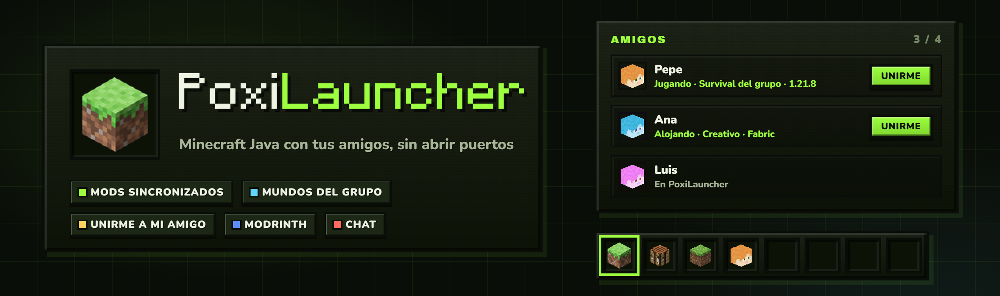
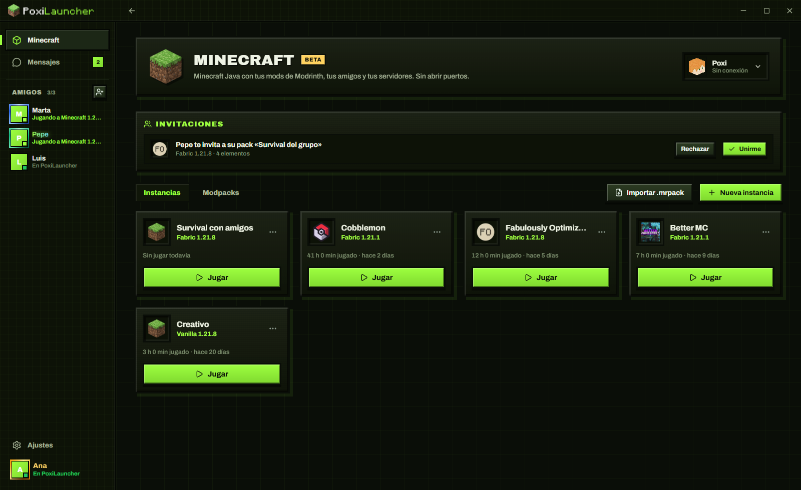
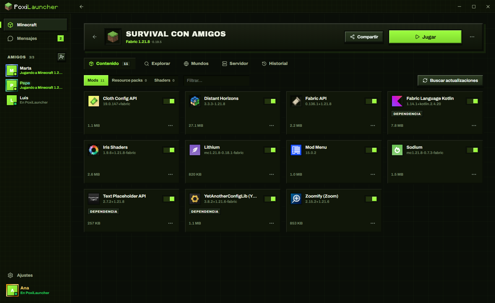
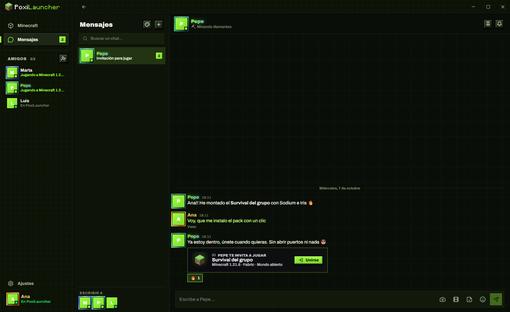
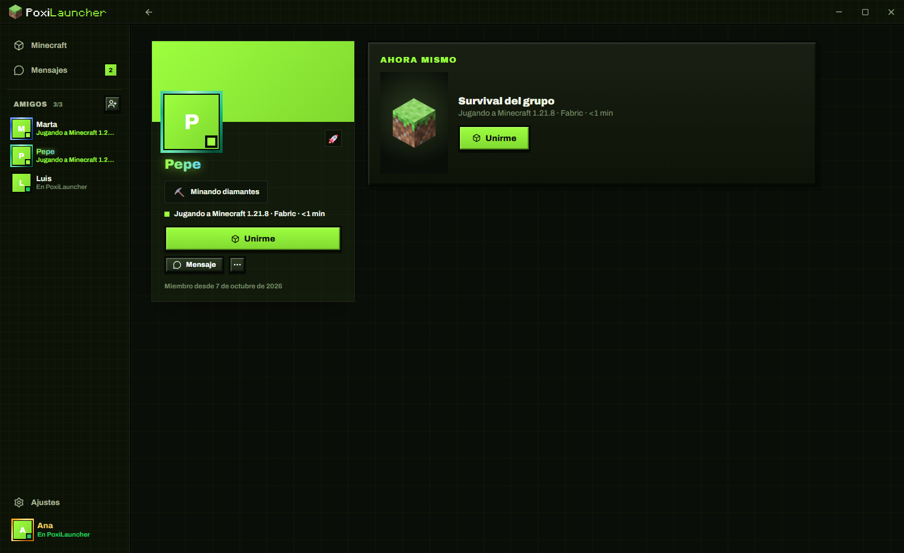

<div align="center">



<br />


**🇪🇸 Español** · [🇬🇧 English](#-english)

### El launcher de Minecraft para jugar **con tus amigos**.

Tus mods, siempre iguales que los del grupo. Vuestro mundo, en la nube y alojable por cualquiera.
Y un botón de **«Unirme»** que te mete en la partida de tu amigo **sin abrir un solo puerto**.

</div>

---

## 🎯 Qué es

**PoxiLauncher** es un launcher de **Minecraft: Java Edition** para Windows pensado para lo que de verdad cuesta
de jugar con amigos: que todos tengan **los mismos mods**, que el mundo **no viva solo en el PC de uno**, que nadie
tenga que pelearse con **el router**, y que si algo se rompe **se pueda deshacer**.

Instala Minecraft, Java, los loaders y los mods de Modrinth él solo. Tú creas la instancia, invitas a tus amigos y
le dais a **Jugar**.

> 🧱 **No es un producto oficial de Minecraft.** Not an official Minecraft product. Not approved by or associated
> with Mojang or Microsoft.

## 📸 Así se ve

<table>
  <tr>
    <td width="50%"></td>
    <td width="50%"></td>
  </tr>
  <tr>
    <td align="center"><sub>🏠 Tus instancias, las invitaciones a packs y tus amigos en directo</sub></td>
    <td align="center"><sub>🧩 Una instancia con sus mods (las dependencias se añaden solas)</sub></td>
  </tr>
  <tr>
    <td width="50%"></td>
    <td width="50%"></td>
  </tr>
  <tr>
    <td align="center"><sub>💬 Chat con invitación a su partida: un clic y estás dentro</sub></td>
    <td align="center"><sub>🤝 El perfil de tu amigo: a qué juega y «Unirme»</sub></td>
  </tr>
</table>

## 📥 Descarga

| Archivo | Para qué |
|---|---|
| **[`PoxiLauncher-Setup-0.5.0.exe`](https://github.com/PoxiiTV/PoxiLauncher/releases/download/v0.5.0/PoxiLauncher-Setup-0.5.0.exe)** | **Instalador** (1 MB): baja el resto, crea los accesos y **se actualiza solo** |
| [`PoxiLauncher-Portable-0.5.0.exe`](https://github.com/PoxiiTV/PoxiLauncher/releases/download/v0.5.0/PoxiLauncher-Portable-0.5.0.exe) | **Portable**: se abre tal cual, sin instalar nada |

Todas las versiones y sus novedades, en [**Releases**](https://github.com/PoxiiTV/PoxiLauncher/releases).

> ℹ️ Como el `.exe` aún no está firmado, Windows puede enseñar el aviso azul de SmartScreen:
> **Más información → Ejecutar de todas formas.** No pide administrador **nunca**.

---

## 🌟 Lo que lo hace distinto

| | |
|---|---|
| 🔗 **Mods sincronizados con tu grupo** | Comparte una instancia como **pack**: tus amigos se instalan exactamente los mismos mods, resource packs y shaders, en la misma versión. Si alguien añade o quita algo, a los demás les sale **«hay cambios»** con la lista, y lo aplican con un clic. Y si un cambio rompe algo, **todo el grupo vuelve atrás** a la versión anterior del pack |
| 🌍 **Mundo del grupo en la nube** | El mundo del pack se guarda en el servidor. **Cualquiera del grupo lo puede alojar**: al abrirlo se baja la última versión y al cerrar se sube la nueva. Mientras alguien lo tiene abierto queda bloqueado para que nadie pise a nadie |
| 🤝 **«Unirme a mi amigo»** | ¿Tu amigo está jugando? Un botón: PoxiLauncher **instala su pack exacto** (si te falta) y **te mete en su partida**, sea un mundo abierto o un servidor |
| 🔗 **Invitar con un enlace** | Crea un enlace y pásalo por Discord o WhatsApp: quien lo abre **se hace tu amigo**, se le **instala el pack** con sus mods y, si estás jugando, **entra directo a tu partida**. Caduca a los 7 días y se puede anular |
| ⚡ **Optimizar con un clic** | Instala los **mods de rendimiento** que existen para tu versión (Sodium, Lithium, FerriteCore…). En Vanilla crea una **copia en Fabric** con tus mundos |
| 🛡️ **Avisos antes de jugar** | Si falta una dependencia, hay un mod repetido, de otra versión o dos que chocan, te avisa al pulsar Jugar y lo **arregla de un clic** |
| 🚪 **Aloja sin abrir puertos** | Abres tu mundo a LAN y tus amigos entran desde fuera de tu casa, **sin tocar el router** ni instalar nada raro: el tráfico va por un túnel propio, solo para tus amigos |
| 🖥️ **Tu servidor en un clic** | Crea un servidor a partir de una instancia (Vanilla, Fabric, Forge o NeoForge), con sus mods de servidor, consola en directo y el mismo túnel para que entren tus amigos |
| ↩️ **Nada se rompe** | Antes de cada cambio de mods se hace **una foto**: «volver a como estaba» en un clic. Y **copias automáticas de tus mundos** cada vez que juegas, que restauras cuando quieras |
| 🩺 **Te explica los crasheos** | Si Minecraft se cierra solo, lee el registro y te dice **qué ha pasado en cristiano** (un mod incompatible, falta memoria, una dependencia…), con el arreglo a un clic cuando lo hay |
| ☕ **Cero Java a mano** | Descarga solo el Java oficial de Mojang que pide cada versión. Nadie tiene que instalar nada |

## ⛏️ Todo lo de Minecraft

| | |
|---|---|
| 📦 **Instancias** | Cada una con su versión, loader, mods, mundos y opciones. Duplicar, exportar, abrir su carpeta, RAM automática según tu PC |
| 🧩 **Loaders** | **Fabric, Quilt, Forge y NeoForge**, instalados solos |
| 🔎 **Modrinth integrado** | Busca mods, resource packs, shaders y modpacks filtrados por tu versión y loader. Las dependencias se añaden solas |
| ⬆️ **Actualizaciones de mods** | Detecta las nuevas **por la huella** de cada archivo (también mods sueltos que añadas tú). Actualiza, baja de versión o **bloquea** un mod para que no cambie |
| 🏷️ **Etiquetas** | Agrupa mods y actívalos o desactívalos a la vez (por ejemplo, todos los de rendimiento) |
| 📜 **Historial** | Cada cambio queda apuntado y se puede deshacer |
| 📁 **`.mrpack`** | Importa modpacks de Modrinth y exporta los tuyos. También **pack de servidor** (sin los mods solo de cliente) |
| ⚙️ **Ajustes compartidos** | Opciones, teclas y lista de servidores iguales en todas tus instancias, si quieres |
| ☁️ **Instancias en la nube** | Tus instancias guardadas en tu cuenta: en otro PC te sale para instalarla |
| 👤 **Cuentas** | **Microsoft** (premium) y **sin conexión**. Varias cuentas y eliges cuál al jugar |
| 🎨 **Skins y capas** | Visor 3D de tu skin, cambiarla (clásica o fina) y elegir capa |
| 🗺️ **Mundos** | Lista de mundos de cada instancia con sus copias de seguridad |

## 👥 Lo social

| | |
|---|---|
| 🧑‍🤝‍🧑 **Amigos en directo** | Ves quién está conectado, **a qué instancia está jugando y en qué servidor**, y te avisa cuando empieza |
| 💬 **Chat de verdad** | Privados y grupos, **GIFs**, **stickers**, **emotes de 7TV**, menciones, reacciones, mensajes fijados, «escribiendo…» y «visto» |
| 📸 **Comparte capturas y clips** | Directamente al chat desde la galería |
| 🎟️ **Invitaciones** | Invita a tu partida desde el chat o la lista de amigos: tu amigo solo pulsa **Unirse** |
| ✨ **Perfil a tu estilo** | Nombre visible con colores, efectos y fuentes, marco del avatar, banner (también GIF), placa de nombre, «sobre mí» y estado personalizado |
| 🏷️ **Apodos** | Ponle a cada amigo el nombre que tú quieras (solo lo ves tú) |
| 🎮 **Discord** | Tu estado en Discord: «Jugando a Minecraft 1.21.8 · Fabric · Survival del grupo» |

## 🎮 Dentro del juego

| | |
|---|---|
| 🧭 **Menú encima del juego** | `Mayús` + `F1` (lo cambias en Ajustes): tus amigos, el chat e invitar a tu partida **sin salir de Minecraft** |
| 📷 **Capturas** | Pulsa `F12` y se guarda la pantalla en `Imágenes\PoxiLauncher\<instancia>` |
| 🎬 **Clips** | **Mantén** `F12` tres segundos y se guardan los últimos 30 s (con sonido) en `Vídeos\PoxiLauncher`, grabados con la gráfica: casi no se nota en los FPS |

## 🔄 Siempre al día

- **Se actualiza solo:** cuando hay versión nueva te avisa, se descarga en segundo plano, se instala en unos segundos **y se vuelve a abrir**.
- **Sin administrador:** se instala solo para tu usuario y nunca pide permisos especiales.
- **Novedades dentro de la app** después de cada actualización.

## 🛡️ Privacidad y seguridad

- 🔐 Tu sesión de **Microsoft se guarda cifrada en tu PC** y **nunca** pasa por nuestro servidor.
- ✅ Todo lo que se descarga (Minecraft, Java, mods, loaders) viene de su **fuente oficial** y se comprueba **por su huella** antes de usarlo.
- 👀 Tus amigos solo ven lo que les toca: tu nombre, tu perfil y a qué estás jugando. Nadie que no sea tu amigo ve nada.
- 🚫 Puedes **bloquear** y **denunciar** a cualquiera (un mensaje o una cuenta). Las denuncias las revisa una persona.
- 🗑️ Puedes **borrar tu cuenta** cuando quieras desde la app.
- 📜 [Política de privacidad](server/public/legal/privacidad.html) y [términos de uso](server/public/legal/terminos.html) (también en la app: **Ajustes → Acerca de**). Edad mínima: **14 años**.

## ⚠️ Avisos

- 🧱 **No es un producto oficial de Minecraft.** No está aprobado por Mojang ni Microsoft, ni tiene relación con ellos.
- 🔑 **Inicio de sesión de Microsoft:** de momento se usa **temporalmente** el *client ID* público de Azure de
  [Prism Launcher](https://github.com/PrismLauncher/PrismLauncher), hasta que Microsoft apruebe el registro propio
  de PoxiLauncher. Si vas a **hacer tu propia versión**, cambia ese ID por el tuyo (`MAIN_VITE_MSA_CLIENT_ID`).
- 🌐 Las funciones sociales (amigos, chat, packs, mundo del grupo, «Unirme») usan el servidor de PoxiLauncher y
  necesitan una **cuenta de PoxiLauncher** (gratis: usuario y contraseña). Jugar a Minecraft no.

---

## 🔧 Compilar

Necesitas [Node.js](https://nodejs.org) 20 o superior.

```bat
start.bat       :: modo desarrollo
build.bat       :: instalador (nsis-web) + portable en release\
publish.bat     :: sube la versión de release\ al servidor de actualizaciones
```

Antes de cada commit: `npm run typecheck` y `npm test`. Las pruebas del servidor: `cd server && npm test`.

Variables del `.env` (no se sube nunca al repo):

| Variable | Qué es |
|---|---|
| `MAIN_VITE_SERVER_URL` | Servidor de cuentas, amigos, chat, packs y túnel |
| `MAIN_VITE_UPDATE_URL` | Canal de actualizaciones (**sin** `/` al final) |
| `MAIN_VITE_WEB_URL` | La web: privacidad, términos y la página de los enlaces de invitación |
| `MAIN_VITE_MSA_CLIENT_ID` | Client ID de Azure para el inicio de sesión de Microsoft |
| `MAIN_VITE_DISCORD_APP_ID` | Aplicación de Discord para la presencia |
| `POXI_DEPLOY_TOKEN` | Token para publicar versiones con `publish.bat` |

### 🗃️ Estructura

```
src/main/            proceso principal (Electron)
  minecraft/         el motor: cuentas, instancias, Modrinth, packs, túnel, servidores, mundos, skins
  account/ chat/     tu cuenta, amigos y chat
  overlay/ capture/  menú dentro del juego, capturas y clips
src/renderer/src/    la interfaz (React)
src/shared/          tipos, textos (ES/EN) y lógica compartida
server/              el servidor: cuentas, chat, packs, túnel, mundos, actualizaciones y panel /admin
```

## 🙏 Gracias a

- **[Minepanel](https://github.com/Ketbome/minepanel)** de Ketbome: la estética Minecraft de la interfaz.
- **[XMCL](https://github.com/Voxelum/minecraft-launcher-core-node)**: instala y arranca Minecraft.
- **[Modrinth](https://modrinth.com)**: los mods, resource packs, shaders y modpacks.
- **[skinview3d](https://github.com/bs-community/skinview3d)**, **[KLIPY](https://klipy.com)** (GIFs),
  **[7TV](https://7tv.app)** y **[BetterTTV](https://betterttv.com)** (emotes), **[7-Zip](https://www.7-zip.org)** y
  **[FFmpeg](https://ffmpeg.org)**.

Todos los créditos y licencias en [`THIRD-PARTY.md`](THIRD-PARTY.md).

## 📜 Licencia

[PolyForm Noncommercial 1.0.0](LICENSE).

Puedes **usarlo, estudiarlo, modificarlo y compartirlo libremente** mientras el uso **no sea comercial**: uso
personal, aprendizaje, proyectos de aficionado, centros educativos y organizaciones sin ánimo de lucro.

¿Tu propia versión? Adelante, pero **cambia el nombre, el logo y los IDs** (Azure, Discord y servidor) por los tuyos.

Para cualquier otra cosa: **alexissjuarezz10@gmail.com**

<div align="center">

---

hecho con 💚 por [poxi](https://github.com/PoxiiTV)

</div>

---

<div align="center">

# 🇬🇧 English

### The Minecraft launcher for playing **with your friends**.

Your mods, always the same as your group's. Your world, in the cloud and hostable by anyone.
And a **"Join"** button that drops you into your friend's game **without opening a single port**.

</div>

## 🎯 What it is

**PoxiLauncher** is a **Minecraft: Java Edition** launcher for Windows, built for what actually makes playing with
friends hard: everyone having **the same mods**, the world **not living on one person's PC**, nobody fighting with
**the router**, and being able to **undo** anything that breaks.

It installs Minecraft, Java, the loaders and Modrinth mods by itself. You create the instance, invite your friends
and hit **Play**.

> 🧱 **Not an official Minecraft product. Not approved by or associated with Mojang or Microsoft.**

## 📥 Download

| File | What it is |
|---|---|
| **[`PoxiLauncher-Setup-0.5.0.exe`](https://github.com/PoxiiTV/PoxiLauncher/releases/download/v0.5.0/PoxiLauncher-Setup-0.5.0.exe)** | **Installer** (1 MB): downloads the rest, creates shortcuts and **updates itself** |
| [`PoxiLauncher-Portable-0.5.0.exe`](https://github.com/PoxiiTV/PoxiLauncher/releases/download/v0.5.0/PoxiLauncher-Portable-0.5.0.exe) | **Portable**: runs as is, nothing to install |

Every version and its changes, in [**Releases**](https://github.com/PoxiiTV/PoxiLauncher/releases).

> ℹ️ The `.exe` isn't signed yet, so Windows may show the blue SmartScreen warning:
> **More info → Run anyway.** It **never** asks for administrator rights.

## 🌟 What makes it different

| | |
|---|---|
| 🔗 **Mods synced with your group** | Share an instance as a **pack**: your friends get exactly the same mods, resource packs and shaders, same versions. When someone adds or removes something, everyone else sees **"there are changes"** with the list and applies them in one click. If a change breaks something, **the whole group rolls back** |
| 🌍 **Group world in the cloud** | The pack's world lives on the server. **Anyone in the group can host it**: it downloads the latest version when they open it and uploads the new one when they close it, locked while someone has it open so nobody overwrites anyone |
| 🤝 **"Join my friend"** | Your friend is playing? One button: PoxiLauncher **installs their exact pack** (if you're missing it) and **puts you in their game**, open world or server |
| 🔗 **Invite with a link** | Create a link and send it on Discord or WhatsApp: whoever opens it **becomes your friend**, gets the **pack installed** with its mods and, if you're playing, **goes straight into your game**. Expires after 7 days and can be revoked |
| ⚡ **One-click optimize** | Installs the **performance mods** available for your version (Sodium, Lithium, FerriteCore…). On Vanilla it creates a **Fabric copy** with your worlds |
| 🛡️ **Warnings before you play** | A missing dependency, a duplicated mod, one for another version or two that clash: it warns you when you press Play and **fixes it in one click** |
| 🚪 **Host without opening ports** | Open your world to LAN and your friends join from outside your home, **without touching the router**: traffic goes through PoxiLauncher's own tunnel, friends only |
| 🖥️ **Your server in one click** | Create a server from an instance (Vanilla, Fabric, Forge or NeoForge) with its server mods, a live console and the same tunnel for your friends |
| ↩️ **Nothing breaks** | A **snapshot** before every mod change: "undo" in one click. And **automatic world backups** every time you play, restorable anytime |
| 🩺 **Explains crashes** | If Minecraft closes by itself, it reads the log and tells you **what happened in plain words** (an incompatible mod, not enough memory, a missing dependency…), with a one-click fix when there is one |
| ☕ **Zero manual Java** | It downloads the official Mojang Java each version needs. Nobody has to install anything |

## ⛏️ Everything Minecraft

| | |
|---|---|
| 📦 **Instances** | Each with its own version, loader, mods, worlds and options. Duplicate, export, open folder, automatic RAM for your PC |
| 🧩 **Loaders** | **Fabric, Quilt, Forge and NeoForge**, installed automatically |
| 🔎 **Built-in Modrinth** | Search mods, resource packs, shaders and modpacks filtered by your version and loader. Dependencies are added automatically |
| ⬆️ **Mod updates** | Detected **by each file's hash** (even mods you drop in yourself). Update, downgrade or **lock** a mod so it never changes |
| 🏷️ **Tags** | Group mods and toggle them together (e.g. all performance mods) |
| 📜 **History** | Every change is recorded and can be undone |
| 📁 **`.mrpack`** | Import Modrinth modpacks and export yours. Also a **server pack** (without client-only mods) |
| ⚙️ **Shared settings** | The same options, keybinds and server list in all your instances, if you want |
| ☁️ **Cloud instances** | Your instances saved to your account: on another PC they show up ready to install |
| 👤 **Accounts** | **Microsoft** (premium) and **offline**. Several accounts, pick one when you play |
| 🎨 **Skins and capes** | 3D skin viewer, change it (classic or slim) and choose a cape |
| 🗺️ **Worlds** | Each instance's worlds with their backups |

## 👥 Social

| | |
|---|---|
| 🧑‍🤝‍🧑 **Live friends** | See who's online, **which instance they're playing and on which server**, and get notified when they start |
| 💬 **A real chat** | DMs and groups, **GIFs**, **stickers**, **7TV emotes**, mentions, reactions, pinned messages, typing and "seen" |
| 📸 **Share screenshots and clips** | Straight into the chat from the gallery |
| 🎟️ **Invites** | Invite friends to your game from the chat or the friends list: they just click **Join** |
| ✨ **Your own profile** | Display name with colours, effects and fonts, avatar frame, banner (GIFs too), nameplate, "about me" and custom status |
| 🏷️ **Nicknames** | Give each friend the name you want (only you see it) |
| 🎮 **Discord** | Your Discord status: "Playing Minecraft 1.21.8 · Fabric · Group Survival" |

## 🎮 In game

| | |
|---|---|
| 🧭 **Overlay menu** | `Shift` + `F1` (change it in Settings): your friends, the chat and invites **without leaving Minecraft** |
| 📷 **Screenshots** | Press `F12` and the screen is saved to `Pictures\PoxiLauncher\<instance>` |
| 🎬 **Clips** | **Hold** `F12` for three seconds to save the last 30 s (with sound) to `Videos\PoxiLauncher`, recorded on the GPU: barely noticeable in FPS |

## 🔄 Always up to date

- **Updates itself:** it lets you know, downloads in the background, installs in a few seconds **and reopens**.
- **No administrator:** it installs just for your user and never asks for special permissions.
- **What's new inside the app** after each update.

## 🛡️ Privacy and security

- 🔐 Your **Microsoft session is stored encrypted on your PC** and **never** goes through our server.
- ✅ Everything it downloads (Minecraft, Java, mods, loaders) comes from its **official source** and is checked **by hash** before use.
- 👀 Your friends only see what they should: your name, your profile and what you're playing. Nobody who isn't your friend sees anything.
- 🚫 You can **block** and **report** anyone (a message or an account). Reports are reviewed by a person.
- 🗑️ You can **delete your account** anytime from the app.
- 📜 [Privacy policy](server/public/legal/privacidad.html) and [terms of use](server/public/legal/terminos.html) (also in the app: **Settings → About**). Minimum age: **14**.

## ⚠️ Notices

- 🧱 **Not an official Minecraft product.** Not approved by or associated with Mojang or Microsoft.
- 🔑 **Microsoft sign-in:** for now it **temporarily** uses [Prism Launcher](https://github.com/PrismLauncher/PrismLauncher)'s
  public Azure *client ID*, until Microsoft approves PoxiLauncher's own registration. If you **build your own
  version**, replace that ID with yours (`MAIN_VITE_MSA_CLIENT_ID`).
- 🌐 Social features (friends, chat, packs, group world, "Join") use the PoxiLauncher server and need a free
  **PoxiLauncher account** (username and password). Playing Minecraft doesn't.

## 🔧 Building

You need [Node.js](https://nodejs.org) 20 or newer.

```bat
start.bat       :: development mode
build.bat       :: installer (nsis-web) + portable in release\
publish.bat     :: uploads release\ to the update server
```

Before every commit: `npm run typecheck` and `npm test`. Server tests: `cd server && npm test`.
The `.env` variables are listed in the Spanish section above (it's never committed).

## 📜 License

[PolyForm Noncommercial 1.0.0](LICENSE).

You can **use, study, modify and share it freely** as long as it's **not commercial**: personal use, learning,
hobby projects, schools and non-profits.

Your own version? Go ahead, but **change the name, logo and IDs** (Azure, Discord and server) to your own.

For anything else: **alexissjuarezz10@gmail.com**

<div align="center">

---

made with 💚 by [poxi](https://github.com/PoxiiTV)

</div>
